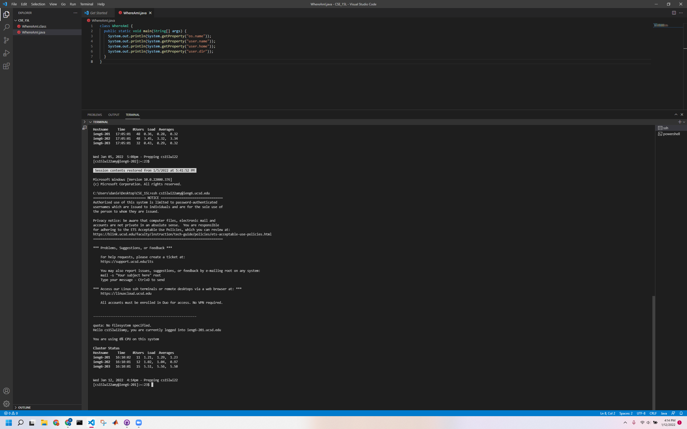
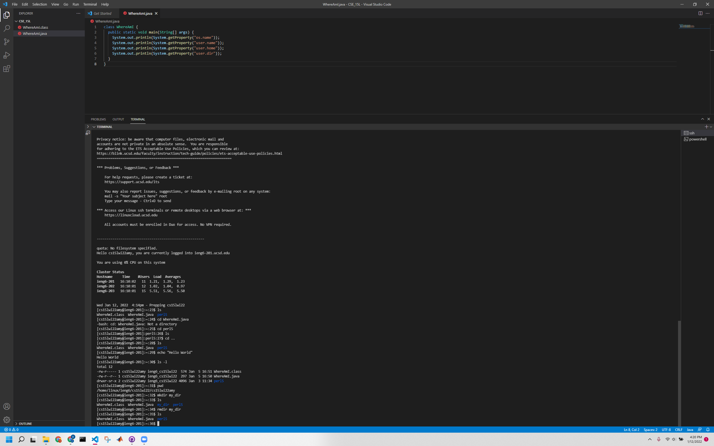
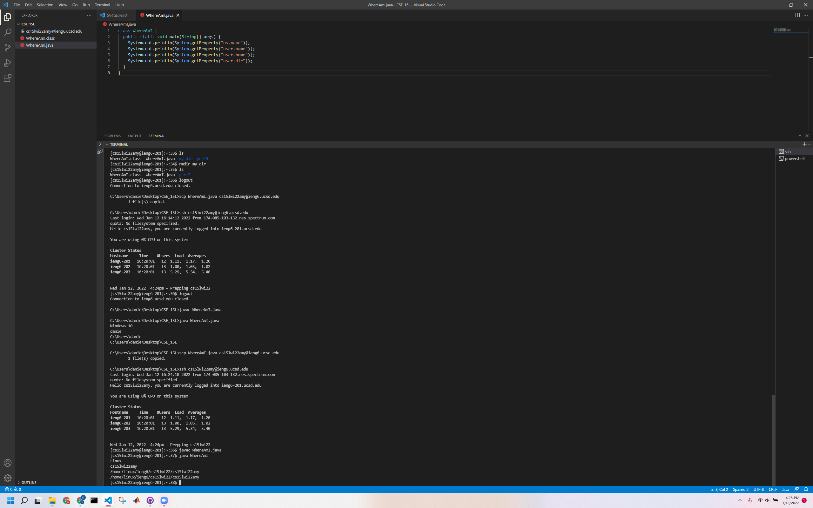
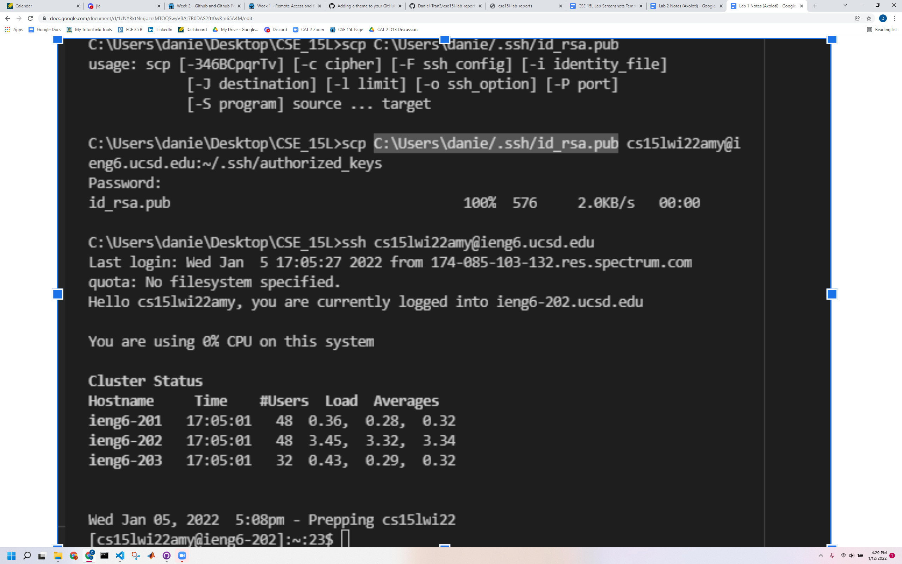
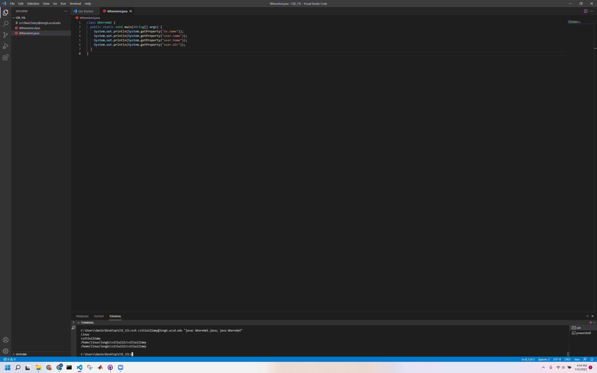

# Week 2, Lab Report 1

## The First Task, Downloading VSCode

* First, I went to VSCode's [website](https://code.visualstudio.com/download) and downloaded the file
* Just using the default download settings worked for me

## The Second Task, Remotely Connecting

* After finding my course-specific code on [UCSD's page](https://sdacs.ucsd.edu/~icc/index.php)
* I could then use that in the ```ssh``` command from VSCode's terminal to remotely access UCSD computers, as above

## The Third Task, Command Experiments

* Inside the UCSD computers, I could experiment with some of the terminal commands
* For example, ```ls``` and its variants let me see information about the files in my directory


## The Fourth Task, Moving Files

* I can even use ```scp``` to copy commands over to remote computers, as shown above
* Using this command on a file that already exists updates the file, allowing me to edit locally and run remotely

## The Fifth Task, SSH Keys

* In order to facilitate the login process, I can use SSH keys (as shown above) instead of a password
* After saving the SSH keys on my computer, I was able to login using the ```ssh``` command alone, no password required!

## The Last Task, Optimization

* Finally, to put everything together (and save some time) I combined terminal commands to make running code remotely easier (about 20 keystrokes were saved by omitting the password, and more time was saved by not waiting to hit enter after the compile and run commands)
* By using "" to run a command after logging in with the ```ssh``` command and using semicolons to run multiple commands, I was able to log in to UCSD's computer and compile and run WhereAmI.java with the one-line command below
* ```ssh cse15lwi22amy@ieng6.ucsd.edu "javac WhereAmI.java; java WhereAmI"```