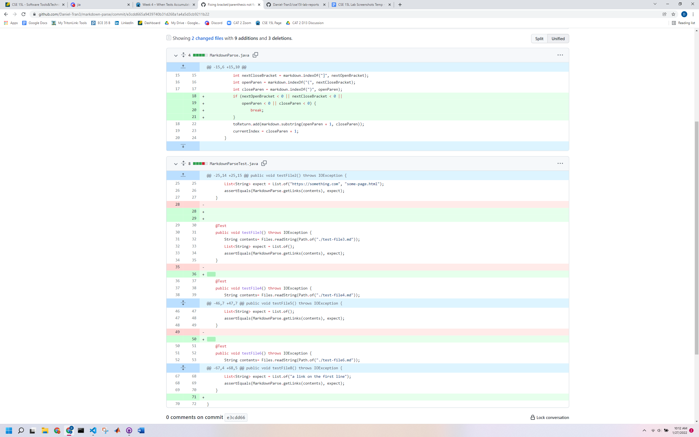
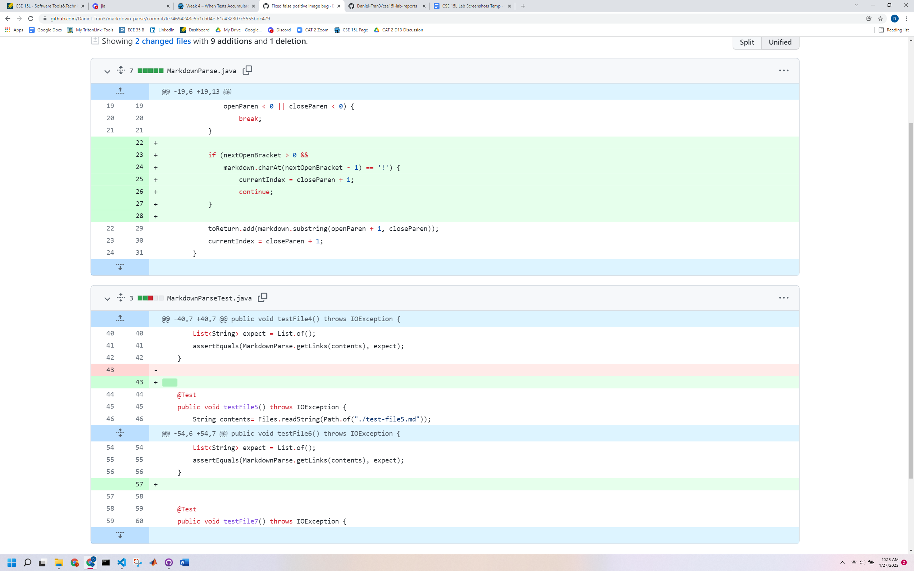
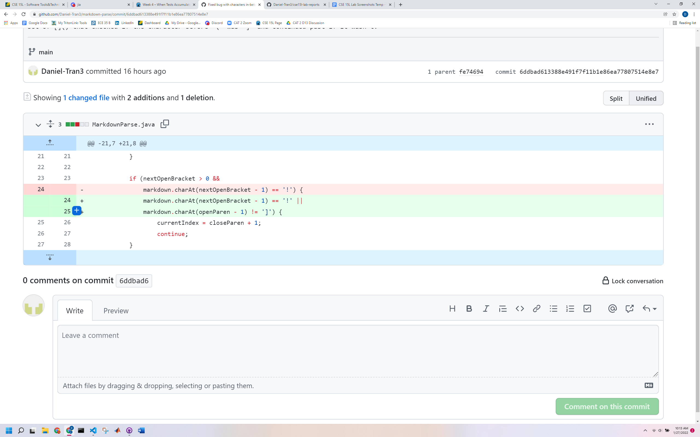

# Week 4, Lab Report 2

## Code Change 1

* Link to failure-inducing input: [Test File 7](https://daniel-tran3.github.io/markdown-parse/test-file7.md)
* Symptom (Command): ```java -cp ".;lib/junit-4.13.2.jar;lib/hamcrest-core-1.3.jar" org.junit.runner.JUnitCore MarkdownParseTest```
* Symptom (output): 5) testFile7(MarkdownParseTest)<br>
java.lang.OutOfMemoryError: Java heap space<br>
        at java.base/java.util.Arrays.copyOf(Arrays.java:3512)<br>
        at java.base/java.util.Arrays.copyOf(Arrays.java:3481)<br>
        at java.base/java.util.ArrayList.grow(ArrayList.java:237)<br>
        at java.base/java.util.ArrayList.grow(ArrayList.java:244)<br>
        at java.base/java.util.ArrayList.add(ArrayList.java:454)<br>
        at java.base/java.util.ArrayList.add(ArrayList.java:467)<br>
        at MarkdownParse.getLinks(MarkdownParse.java:18)<br>
        at MarkdownParseTest.testFile7(MarkdownParseTest.java:62)<br>
* Relationship between bug, symptom, and failure-inducing input: The bug was that the code did not check whether or not the variables storing the locations of '[', ']', '(', or ')' were -1 (i.e., not in the file), leading to infinite loops. When an uneven number of brackets or parentheses were in the failure-inducing input (like in test file 7), the code would run an infinite loop until memory failed (as seen in the symptom above).

## Code Change 2

* Link to failure-inducing input: [Test File 6](https://daniel-tran3.github.io/markdown-parse/test-file6.md)
* Symptom (Command): ```java -cp ".;lib/junit-4.13.2.jar;lib/hamcrest-core-1.3.jar" org.junit.runner.JUnitCore MarkdownParseTest```
* Symptom (output): 2) testFile6(MarkdownParseTest)<br>
java.lang.AssertionError: expected:<[page.com]> but was:<[]><br>
        at org.junit.Assert.fail(Assert.java:89)<br>
        at org.junit.Assert.failNotEquals(Assert.java:835)<br>
        at org.junit.Assert.assertEquals(Assert.java:120)<br>
        at org.junit.Assert.assertEquals(Assert.java:146)<br>
        at MarkdownParseTest.testFile6(MarkdownParseTest.java:55)<br>
* Relationship between bug, symptom, and failure-inducing input: The bug was that the code did not check whether or not there was a '!' in front of the first '['] (i.e., the "link" was an image, which doesn't count), leading to false positives. When there was an image in the test file (like in test file 6), the image would be listed in a valid link and would be shown, even though it should not have been included (as seen in the symptom above, where "expected" is the actual output and the second part is what the output should have been).

## Code Change 3

* Link to failure-inducing input: [Test File 5](https://daniel-tran3.github.io/markdown-parse/test-file5.md)
* Symptom (Command): ```java -cp ".;lib/junit-4.13.2.jar;lib/hamcrest-core-1.3.jar" org.junit.runner.JUnitCore MarkdownParseTest```
* Symptom (output): 1) testFile5(MarkdownParseTest)<br>
java.lang.AssertionError: expected:<[page.com]> but was:<[]><br>
        at org.junit.Assert.fail(Assert.java:89)<br>
        at org.junit.Assert.failNotEquals(Assert.java:835)<br>
        at org.junit.Assert.assertEquals(Assert.java:120)<br>
        at org.junit.Assert.assertEquals(Assert.java:146)<br>
        at MarkdownParseTest.testFile5(MarkdownParseTest.java:48)<br>
* Relationship between bug, symptom, and failure-inducing input: The bug was that the code did not check whether or not there was anything in-between the ']' and the '(' (which should have invalidated the link), leading to false positives. When there was some string between the ']' and the '(' (like in test file 5), the string in the parentheses would be listed in a valid link and would be shown, even though it should not have been included (as seen in the symptom above, where "expected" is the actual output and the second part is what the output should have been).