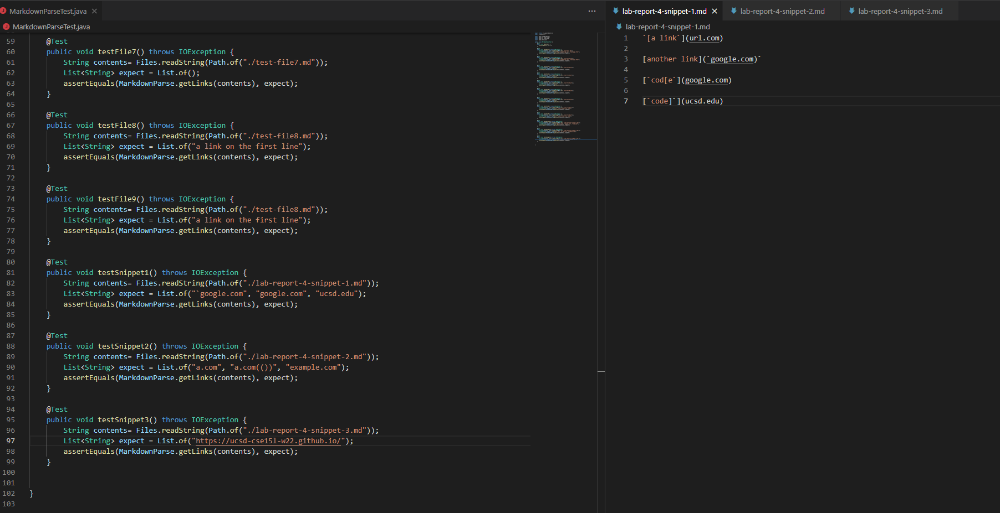
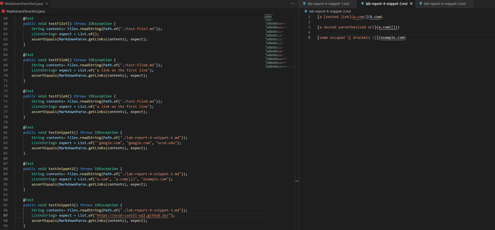
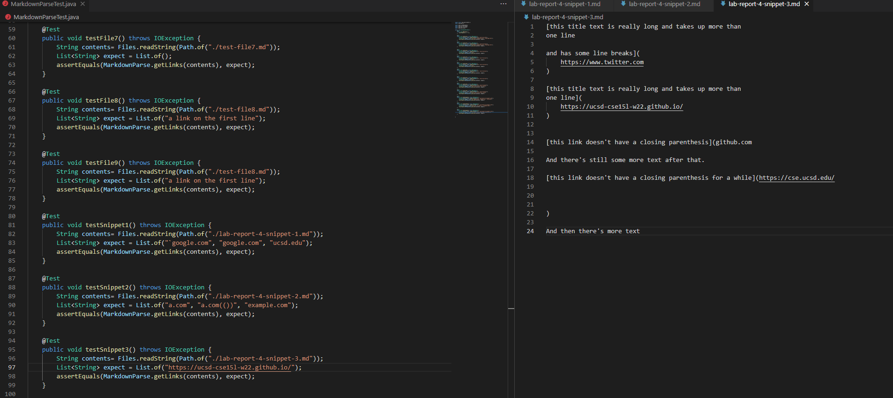

# Week 8, Lab Report 4
Note: All test code is copied to both mine and the reviewed implementations of MarkdownParse<br>
[My repository](https://github.com/Daniel-Tran3/markdown-parse)<br>
[Other repository](https://github.com/annakkin/markdown-parse)


## Test 1

* Snippet 1:<br>
```
     `[a link`](url.com)

    [another link](`google.com)`

    [`cod[e`](google.com)

    [`code]`](ucsd.edu) 
```

* Desired Output
```
["`google.com", "google.com", "ucsd.edu"]
```

* MarkdownParseTest.java Code:<br>
```
    @Test
    public void testSnippet1() throws IOException {
        String contents= Files.readString(Path.of("./lab-report-4-snippet-1.md"));
        List<String> expect = List.of("`google.com", "google.com", "ucsd.edu");
        assertEquals(MarkdownParse.getLinks(contents), expect);
    }
```

* MarkdownParseTest.java Screenshot:


* My implementation's output:<br>
```
1) testSnippet1(MarkdownParseTest)
java.lang.AssertionError: expected:<[url.com, `google.com, google.com, ucsd.edu]> but was:<[`google.com, google.com, ucsd.edu]>
        at org.junit.Assert.fail(Assert.java:89)
        at org.junit.Assert.failNotEquals(Assert.java:835)
        at org.junit.Assert.assertEquals(Assert.java:120)
        at org.junit.Assert.assertEquals(Assert.java:146)
        at MarkdownParseTest.testSnippet1(MarkdownParseTest.java:84)
```

* Other implementation's output:<br>
```
1) testSnippet1(MarkdownParseTest)
java.lang.AssertionError: expected:<[url.com, `google.com, google.com]> but was:<[`google.com, google.com, ucsd.edu]>
        at org.junit.Assert.fail(Assert.java:89)
        at org.junit.Assert.failNotEquals(Assert.java:835)
        at org.junit.Assert.assertEquals(Assert.java:120)
        at org.junit.Assert.assertEquals(Assert.java:146)
        at MarkdownParseTest.testSnippet1(MarkdownParseTest.java:111)
```


## Test 2

* Snippet 2:<br>
```
    [a [nested link](a.com)](b.com)

    [a nested parenthesized url](a.com(()))

    [some escaped \[ brackets \]](example.com) 
```

* Desired Output
```
["a.com", "a.com(())", "example.com"]
```
* MarkdownParseTest.java Code:<br>
```
    @Test
    public void testSnippet2() throws IOException {
        String contents= Files.readString(Path.of("./lab-report-4-snippet-2.md"));
        List<String> expect = List.of("a.com", "a.com(())", "example.com");
        assertEquals(MarkdownParse.getLinks(contents), expect);
    }
```

* MarkdownParseTest.java Screenshot:


* My implementation's output:<br>
```
2) testSnippet2(MarkdownParseTest)
java.lang.AssertionError: expected:<[a.com, a.com((, example.com]> but was:<[a.com, a.com(()), example.com]>
        at org.junit.Assert.fail(Assert.java:89)
        at org.junit.Assert.failNotEquals(Assert.java:835)
        at org.junit.Assert.assertEquals(Assert.java:120)
        at org.junit.Assert.assertEquals(Assert.java:146)
        at MarkdownParseTest.testSnippet2(MarkdownParseTest.java:91)
```

* Other implementation's output:<br>
```
2) testSnippet2(MarkdownParseTest)
java.lang.AssertionError: expected:<[a.com, a.com((]> but was:<[a.com, a.com(()), example.com]>
        at org.junit.Assert.fail(Assert.java:89)
        at org.junit.Assert.failNotEquals(Assert.java:835)
        at org.junit.Assert.assertEquals(Assert.java:120)
        at org.junit.Assert.assertEquals(Assert.java:146)
        at MarkdownParseTest.testSnippet2(MarkdownParseTest.java:118)
```


## Test 3

* Snippet 3:<br>
``` 
    [this title text is really long and takes up more than 
    one line

    and has some line breaks](
        https://www.twitter.com
    )

    [this title text is really long and takes up more than 
    one line](
        https://ucsd-cse15l-w22.github.io/
    )


    [this link doesn't have a closing parenthesis](github.com

    And there's still some more text after that.

    [this link doesn't have a closing parenthesis for a while](https://cse.ucsd.edu/


    )

    And then there's more text
```

* Desired Output
```
["https://ucsd-cse15l-w22.github.io/"]
```

* MarkdownParseTest.java Code:<br>
```
    @Test
    public void testSnippet3() throws IOException {
        String contents= Files.readString(Path.of("./lab-report-4-snippet-3.md"));
        List<String> expect = List.of("https://ucsd-cse15l-w22.github.io/");
        assertEquals(MarkdownParse.getLinks(contents), expect);
    }
```

* MarkdownParseTest.java Screenshot:


* My implementation's output:<br>
```
3) testSnippet3(MarkdownParseTest)
java.lang.AssertionError: expected:<[]> but was:<[https://ucsd-cse15l-w22.github.io/]>
        at org.junit.Assert.fail(Assert.java:89)
        at org.junit.Assert.failNotEquals(Assert.java:835)
        at org.junit.Assert.assertEquals(Assert.java:120)
        at org.junit.Assert.assertEquals(Assert.java:146)
        at MarkdownParseTest.testSnippet3(MarkdownParseTest.java:98)
```

* Other implementation's output:<br>
```
    3) testSnippet3(MarkdownParseTest)
    java.lang.AssertionError: expected:<[
        https://www.twitter.com
    ,
        https://ucsd-cse15l-w22.github.io/
    , github.com

    And there's still some more text after that.

    [this link doesn't have a closing parenthesis for a while](https://cse.ucsd.edu/


    ]> but was:<[https://ucsd-cse15l-w22.github.io/]>
            at org.junit.Assert.fail(Assert.java:89)
            at org.junit.Assert.failNotEquals(Assert.java:835)
            at org.junit.Assert.assertEquals(Assert.java:120)
            at org.junit.Assert.assertEquals(Assert.java:146)
            at MarkdownParseTest.testSnippet3(MarkdownParseTest.java:125)
```


## Questions to answer:
* Is there a small code change that will make my program work for snippet 1 and all other related cases with inline code and backticks? <br>
A small code change that might work would include a search for the next backtick and confirming if it is before the next open bracket. Then, the program would immediately skip to the next backtick/newline or break if one isn't found, since no open brackets would apply until the backtick is closed (similar code with closed brackets). I don't think that the parentheses require such checks, since backticks appear to be included as part of the actual link.

* Is there a small code change that will make my program work for snippet 2 and all other related cases with nested parentheses, brackets, and escaped brackets? <br>
A small code change that could work here might be to capture everything between the outermost set of brackets (use a stack) and examining the contents within to see if other links are held within (which would take priority), while a similar approach could work on the link itself, to make sure that all of the parentheses are matched using a stack. Within the brackets, escape characters could be checked for to denote that brackets are to be considered as simple characters. The above approach may stray above 10 lines, if all suggestions are accounted for.

* Is there a small code change that will make my program work for snippet 3 and all other related cases with newlines in brackets and parentheses?
I do not think that this code change would be small, since the rules regarding whitespace and markdown seem quite complicated. I think that the necessary changes would involve checking for the specific type of whitespace around the link itself (since that seems to be where the problem is in the first example) and that trimming might be needed on valid links that do not include whitespace, but I am not sure what qualifies as "too much" whitespace, or how I would check for that satisfactorily in less than ten lines.
